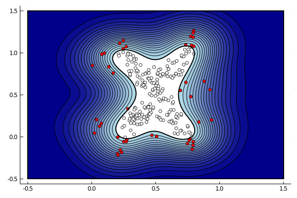

# SVDD.jl
_A Julia package for Support Vector Data Description._

[![][docs-master-img]][docs-master-url]
[](https://github.com/englhardt/SVDD.jl/actions)
[](https://codecov.io/gh/englhardt/SVDD.jl)

This package implements one-class classifiers and based on support vector data description.
The package has been developed as part of a benchmark suite for [active-learning](https://en.wikipedia.org/wiki/Active_learning_(machine_learning)) strategies for one-class classification. For more information about this research project, see the [OCAL project](https://www.ipd.kit.edu/ocal/) website, and the companion paper.

> Holger Trittenbach, Adrian Englhardt, Klemens Böhm, "An overview and a benchmark of active learning for outlier detection with one-class classifiers", DOI: [10.1016/j.eswa.2020.114372](https://doi.org/10.1016/j.eswa.2020.114372), Expert Systems with Applications, 2021.

## Installation
This package works with Julia 1.0 or newer.
This package is not registered yet. Please use the following command to add the package with Pkg3.
```Julia
using Pkg
Pkg.add("https://github.com/englhardt/SVDD.jl.git")
```

## Overview

[One-class classifiers](https://en.wikipedia.org/wiki/One-class_classification) learn to identify if objects belong to a specific class, often used for outlier detection.
The package implements several one-class classifiers, and strategies to initialize parameters.
We other visualizations in our example notebooks, see [Examples](#examples)



### Classifiers

Currently, the classifiers have been implemented as optimization problems based on [JuMP](https://github.com/JuliaOpt/JuMP.jl).
The package includes:

* Vanilla Support Vector Data Description (VanillaSVDD) [1]
* SVDD with negative examples (SVDDNeg) [1]
* Semi-supervised Anomaly Detection (SSAD) [2]
* Subspace SVDD (SubSVDD) [3]

### Parameter Initialization

There are two types of parameters to estimate for the classifiers: cost parameters and a kernel function.
The packages includes the following strategies to initialize parameters.

* _Gauss Kernel gamma_
  * Rule of Scott [4]
  * Rule of Silverman [5]
  * Mean criterion [6]
  * Modified mean criterion [7]
  * Wang data shifting [8]
  * Fixed Gamma
* _Cost parameters C_
  * Rule of Tax [1]
  * Binary Search
  * Fixed C

### Conventions
* _Classification scores:_ The classifiers return scores by the following convention:
  * score > 0 for outliers
  * score <= 0 for inliers
* _Data Format:_ The data is expected to be in column major order, i.e., first array dimension is the attribute, second is the observation.
  * `[1 2 3 4; 5 6 7 8]` is a 2x4 Array with 2 attributes and 4 observations


## Examples

There are two notebooks that show to train a SVDD ([here](examples/svdd_training.ipynb)) and how to use the parametrization methods ([here](examples/svdd_parametrization.ipynb)).
Execute the following commands to run the example notebooks:
```
git clone https://github.com/englhardt/SVDD.jl
cd SVDD/examples
julia -e "using Pkg; Pkg.instantiate()"
julia -e "using IJulia; notebook()"
```
You can then access the jupyter notebook server at [http://localhost:8888/](http://localhost:8888/) and run the notebooks.

## Authors
We welcome contributions and bug reports.

This package is developed and maintained by [Holger Trittenbach](https://github.com/holtri/) and [Adrian Englhardt](https://github.com/englhardt).

## References

[1] Tax, David MJ, and Robert PW Duin. "Support vector data description." Machine learning 54.1 (2004): 45-66.<br>
[2] Görnitz, Nico, et al. "Toward supervised anomaly detection." Journal of Artificial Intelligence Research 46 (2013): 235-262.<br>
[4] Scott, David W. Multivariate density estimation: theory, practice, and visualization. John Wiley & Sons, 2015.<br>
[3] Trittenbach, Holger, and Klemens Böhm. "One-Class Active Learning for Outlier Detection with Multiple Subspaces." ACM International Conference on Information and Knowledge Management (CIKM), 2019.<br>
[5] Silverman, Bernard W. Density estimation for statistics and data analysis. Routledge, 2018.<br>
[6] Chaudhuri, Arin, et al. "The mean and median criteria for kernel bandwidth selection for support vector data description." 2017 IEEE International Conference on Data Mining Workshops (ICDMW). IEEE, 2017.<br>
[7] Liao, Yuwei, et al. "A new bandwidth selection criterion for using SVDD to analyze hyperspectral data." Algorithms and Technologies for Multispectral, Hyperspectral, and Ultraspectral Imagery XXIV. Vol. 10644. International Society for Optics and Photonics, 2018.<br>
[8] Wang, Siqi, et al. "Hyperparameter selection of one-class support vector machine by self-adaptive data shifting." Pattern Recognition 74 (2018): 198-211.

[docs-master-img]: https://img.shields.io/badge/docs-master-blue.svg
[docs-master-url]: https://englhardt.github.io/SVDD.jl/latest
