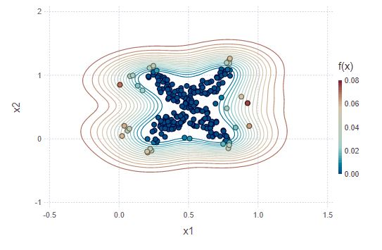

# SVDD.jl
_A Julia package for Support Vector Data Description._

[](https://travis-ci.com/englhardt/SVDD.jl)
[](https://coveralls.io/github/englhardt/SVDD.jl?branch=master)

This package implements one-class classifiers and based on support vector data description.
The package has been developed as part of a benchmark suite for [active-learning](https://en.wikipedia.org/wiki/Active_learning_(machine_learning)) strategies for one-class classification. For more information about this research project, see the [OCAL project](https://www.ipd.kit.edu/ocal/) website, and the companion paper.

> Holger Trittenbach, Adrian Englhardt, Klemens Böhm, "An Overview and a Benchmark of Active Learning for One-Class Classification" [arXiv:1808.04759](https://arxiv.org/abs/1808.04759), 14 Aug 2018

## Installation
This package works with Julia 1.0.
This package is not registered yet. Please use the following command to add the package with Pkg3.
```Julia
using Pkg
Pkg.add("https://github.com/englhardt/SVDD.jl.git")
```

The results presented in the paper base on a previous version of the package and on Julia 0.6.
To reproduce the experiment results from the paper, use the old package manager (with Pkg.clone) and checkout SVDD.jl at tag `v1.0`.

## Overview

[One-class classifiers](https://en.wikipedia.org/wiki/One-class_classification) learn to identify if objects belong to a specific class, often used for outlier detection.
The package implements several one-class classifiers, and strategies to initialize parameters.
The jupyter notebook in `examples` gives a jump start on how to use this package.



### Classifiers

Currently, the classifiers have been implemented as optimization problems based on [JuMP](https://github.com/JuliaOpt/JuMP.jl).
The package includes:

* Vanilla Support Vector Data Description (VanillaSVDD) [1]
* SVDD with negative examples (SVDDNeg) [1]
* Semi-supervised Anomaly Detection (SSAD) [2]

### Parameter Initialization

There are two types of parameters to estimate for the classifiers: cost parameters and a kernel function.
The packages includes the following strategies to initialize parameters.

* _Gauss Kernel gamma_
  * Rule of Scott [3]
  * Rule of Silverman [4]
  * Fixed Gamma
* _Cost parameters C_
  * Rule of Tax [1]
  * Binary Search
  * Fixed C

### Conventions
* _Classification scores:_ The classifiers return scores by the following convention:
  * score > 0 for outliers
  * score <= 0 for inliers
* _Data Format:_ The data is expected to be in column major order, i.e., first array dimension is the attribute, second is the observation.
  * `[1 2 3 4; 5 6 7 8]` is a 2x4 Array with 2 attributes and 4 observations

## Authors
We welcome contributions and bug reports.

This package is developed and maintained by [Holger Trittenbach](https://github.com/holtri/) and [Adrian Englhardt](https://github.com/englhardt).

## References

[1] Tax, David MJ, and Robert PW Duin. "Support vector data description." Machine learning 54.1 (2004): 45-66.

[2] Görnitz, Nico, et al. "Toward supervised anomaly detection." Journal of Artificial Intelligence Research 46 (2013): 235-262.

[3] Scott, David W. Multivariate density estimation: theory, practice, and visualization. John Wiley & Sons, 2015.

[4] Silverman, Bernard W. Density estimation for statistics and data analysis. Routledge, 2018.
